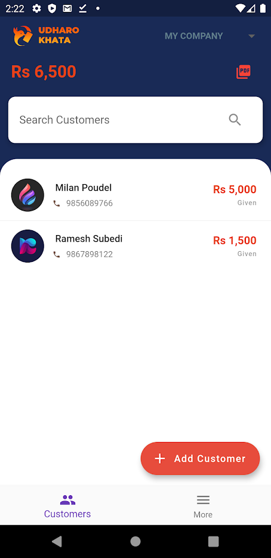
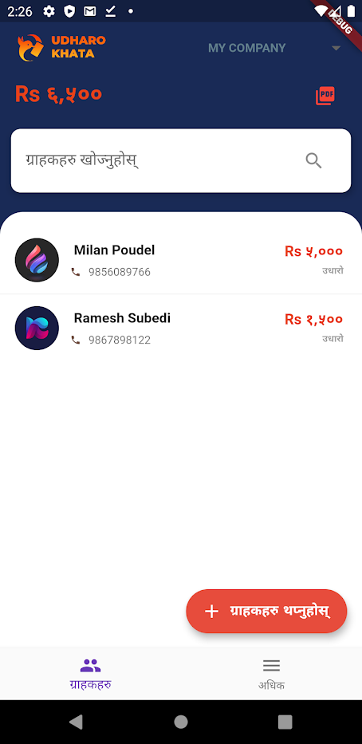
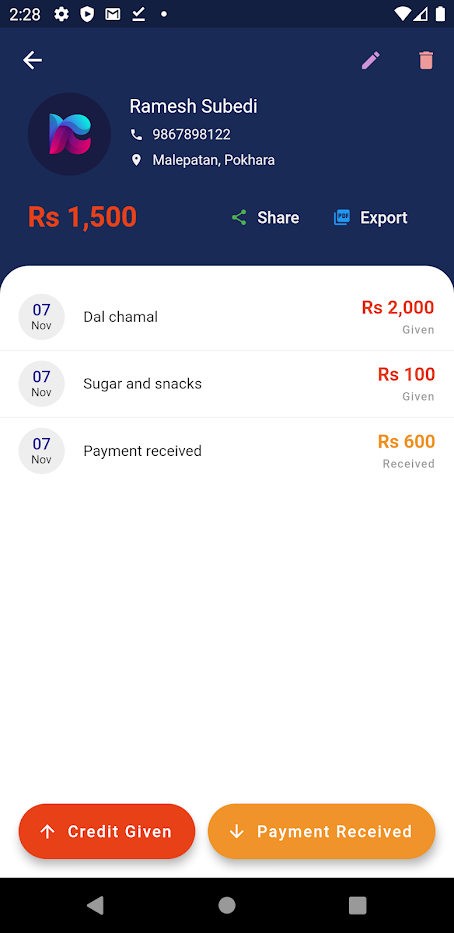
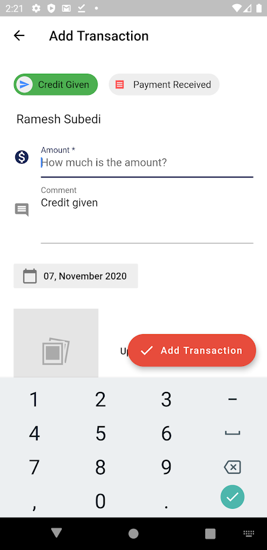
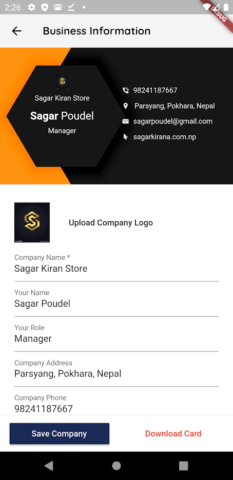
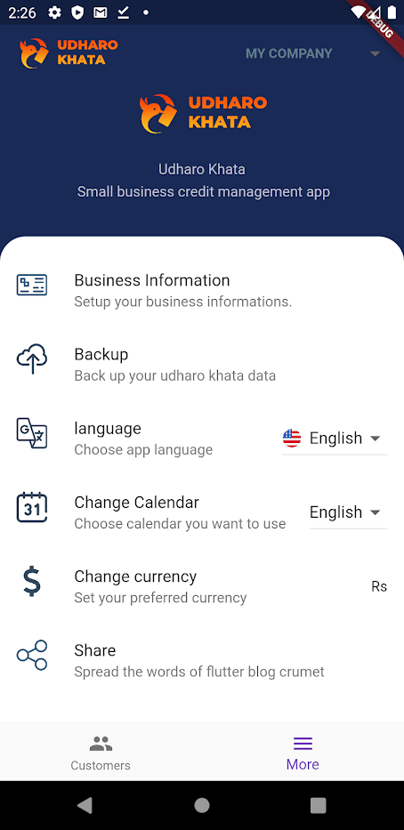

  
  <h1>Udharo Khata</h1>
  <strong>Udharo khata is a debit and credit management app for small-size shops and businesses.</strong>

 

## 🎁 Features

- Manage Credits (Udharo) in your business.
- Built for local shopkeepers and small businesses.
- Generate your business card, download, and share.
- Export all transactions report in pdf.
- Export transactions report by customers in pdf.
- Manage multiple businesses.
- Use a custom currency
- Multi calendar support (English and Nepali)
- Multilanguage support (English and Nepali)
- Backup your data in google drive
- Restore your data from google drive
- Import customers from your contact
- and so on.

## 📱 Screenshots

|                                                       |                                                       |                                                       |
| ----------------------------------------------------- | ----------------------------------------------------- | ----------------------------------------------------- |
|             |  |  |
|  |  |  |
|  |                                                       |                                                       |

## 🙌 Want to Contribute?

We are open to all kinds of contributions. If you want to:

- 🤔 Suggest a feature
- 🐛 Report an issue
- 👨‍💻 Contribute to the code

## 📑 LICENCE

Released under the [MIT](./LICENSE) License. 
